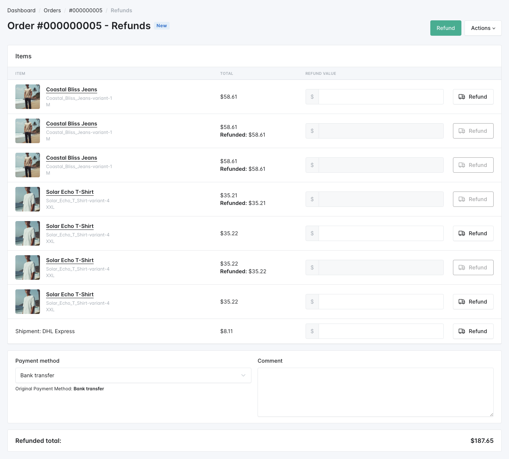
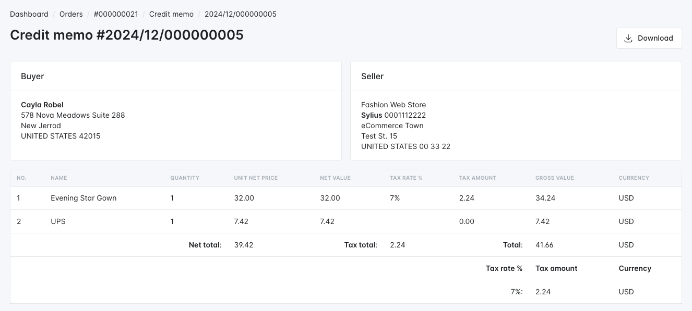

<p align="center">
    <a href="https://sylius.com" target="_blank">
        <picture>
          <source media="(prefers-color-scheme: dark)" srcset="https://media.sylius.com/sylius-logo-800-dark.png">
          <source media="(prefers-color-scheme: light)" srcset="https://media.sylius.com/sylius-logo-800.png">
          
        </picture>
    </a>
</p>

<h1 align="center">Refund Plugin</h1>

<p align="center"></p>

<p align="center"><a href="https://sylius.com/plugins/" target="_blank"></a></p>

<p align="center">This plugin provides basic refunds functionality for Sylius application.</p>






## Business value

In contrast to basic Refund functionality delivered by core Sylius bundles, Refund Plugin offers much wider range of
possibilities and business scenarios.

Once an Order is paid, an Administrator is able to access Refunds section of a given Order and perform a Refund
of chosen items or shipments. What's more, if a more detailed scenario occurs, an Administrator is able to refund an item
partially.

From Administrator's point of view, every Refund request results in creating two entities:
* Credit Memo - a document representing a list of refunded items (downloadable and sent to Customer via .pdf file)
* Refund Payment - entity representing payment in favour of the Customer

## Installation

1. Require plugin with composer:

    ```bash
    composer require sylius/refund-plugin
    ```

    > Remember to allow community recipes with `composer config extra.symfony.allow-contrib true` or during plugin installation process

1. Apply migrations to your database:

    ```bash
    bin/console doctrine:migrations:migrate
    ```

1. Default configuration assumes enabled PDF file generator. If you don't want to use that feature change your app configuration:

   ```yaml
   # config/packages/sylius_refund.yaml
   sylius_refund:
      pdf_generator:
         enabled: false
   ```

   Otherwise, check if you have wkhtmltopdf binary. If not, you can download it [here](https://wkhtmltopdf.org/downloads.html).

   In case wkhtmltopdf is not located in `/usr/local/bin/wkhtmltopdf` modify the `WKHTMLTOPDF_PATH` environment variable in the `.env` file:
   
   ```
   WKHTMLTOPDF_PATH=/usr/local/bin/wkhtmltopdf # Change this! :)
   ```

#### Beware!

This installation instruction assumes that you're using Symfony Flex. If you don't, take a look at the
[legacy installation instruction](docs/legacy_installation.md). However, we strongly encourage you to use
Symfony Flex, it's much quicker! :)

## Extension points

Refund Plugin is strongly based on both commands and events. Let's take RefundUnitsAction as an example. The whole
process consists of following steps:

* Getting data from request
* Create a Command and fill it with data
* Dispatch Command
* Handle Command
* Fire Event
* Catch Event in Listener class

Using command pattern and events make each step independent which means that providing custom implementation of given
part of refunding process doesn't affect any other step.

Apart from Events and Commands Refund Plugin is also based on mechanisms derived from core Sylius bundles such as:

* [Resources](https://docs.sylius.com/en/1.2/components_and_bundles/components/Resource/index.html)
* [Grids](https://docs.sylius.com/en/1.2/components_and_bundles/bundles/SyliusGridBundle/index.html)
* [State Machine](https://docs.sylius.com/en/1.2/book/architecture/state_machine.html)

Configuration of all elements mentioned above can be found and customized in `config.yml` file.

## Payment requirements

By default to refund your order, you need to have at least one available payment method configured with `offline` gateway.
In case your custom refund logic allows a different type of gateway (for example `stripe`), you should modify the specific parameter,
as shown below:

```yaml
# config/services.yaml
 
parameters:
    sylius_refund.supported_gateways:
        - offline
        - stripe
```

Online refund logic should be implemented if you need it.
As the first try for the possible customization, you can check out `Sylius\RefundPlugin\Event\UnitsRefunded` event.

## Post-refunding process

After units are refunded, there are multiple other processes that should be triggered. By default, after units refund, there should be **CreditMemo** and
**RefundPayment** generated. As they're strictly coupled with each other, **RefundPayment** is always created after the **CreditMemo**. Moreover, if **RefundPayment**
fails, related **CreditMemo** should not be created as well.

`Sylius\RefundPlugin\ProcessManager\UnitsRefundedProcessManager` service facilitates the whole process. If you want to add one or more steps to it, you should create
a service implementing `Sylius\RefundPlugin\ProcessManager\UnitsRefundedProcessStepInterface`, and register if with proper tag:

```yaml
App\ProcessManager\CustomAfterRefundProcessManager:
    tags:
        - { name: sylius_refund.units_refunded.process_step, priority: 0 }
```

Tagged services would be executed according to their priority (descending). 

## Supported branches

* `1.3` (v1.3.*) - security fixes
* `1.4` (v1.4.*) - bug fixes, improvements
* `1.5` (v1.5.*) - new features
* `2.0` (v2.0.*) - new features, removing deprecations, BC breaks

## Security issues

If you think that you have found a security issue, please do not use the issue tracker and do not post it publicly.
Instead, all security issues must be sent to `security@sylius.com`.
